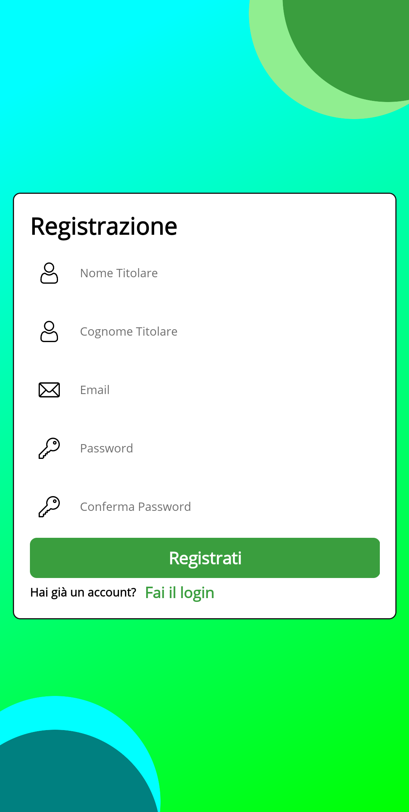

# Bank Application with .NET MAUI

This is a .NET MAUI bank application created for a school project.

# Table of contents

- [Description](#description)
- [Features](#features)
  - [User Authentication](#user-authentication)
  - [Banking and Transactions](#banking-and-transactions)
  - [User Profile](#user-profile)
- [Built with](#built-with)
- [Screenshots](#screenshots)
- [Authors](#authors)
- [Backend](#backend)
- [Frontend](#frontend)
- [License](#license)

## Description

This application is part of a larger project which includes a backend and a frontend.
The purpose of this project was to create a bank application and website.

## Features

### User Authentication

- Register with required fields: Email, Password, Confirm Password, Name, Surname.
- Login with required fields: Email and Password.
- Automatically clear fields and prompt for retry if no login within 30 seconds.

### Banking and Transactions

- Make financial transactions.
- Perform money transfers.
- Filter transactions by number, category, and date.
- Details button on transactions.
- Export filtered transactions to Excel or CSV.
- Perform cell phone charging.

### User Profile

- View profile information.
- Change the password.

## Built with

This application was built with:

## Screenshots

  
Screenshots

  

    
Icon and Splash screen

    <h3>App Icon</h3>
    
    <h3>Splash Screen</h3>
    
  

  

    
Login and Registration

    <h3>Login Page</h3>
    
    <h3>Registration Page</h3>
    
  

  
  

    
Homepage and Navigation Menu

    <h3>Homepage</h3>
    
    <h3>Navigation Menu</h3>
    
  

  

    
Banking and Transactions

    <h3>Transaction Page</h3>
    
    <h3>Money Transfer Page</h3>
    
    <h3>Cellphone Charge Page</h3>
    
    <h3>Transaction Details Page</h3>
    
  

  

    
User Profile

    <h3>Profile Page</h3>
    
    <h3>Change Password Page</h3>
    
  

## Authors

| Author          | GitHub Profile                                       |
| --------------- | ---------------------------------------------------- |
| godwin-17       | [GitHub Profile](https://github.com/godwin-17)       |
| Tescarinho      | [GitHub Profile](https://github.com/Tescarinho)      |
| dani01Lost4ever | [GitHub Profile](https://github.com/dani01Lost4ever) |
| Dexterxd18312   | [GitHub Profile](https://github.com/Dexterxd18312)   |

## Backend

- [Backend repo](https://github.com/dani01Lost4ever/BackEnd-ProjectWork)

## Frontend

- [Frontend repo](https://github.com/Rikymeggio1234/bbank)

# License

This project is licensed under the terms of the MIT license. See the [LICENSE.md](LICENSE.md) for more information.
